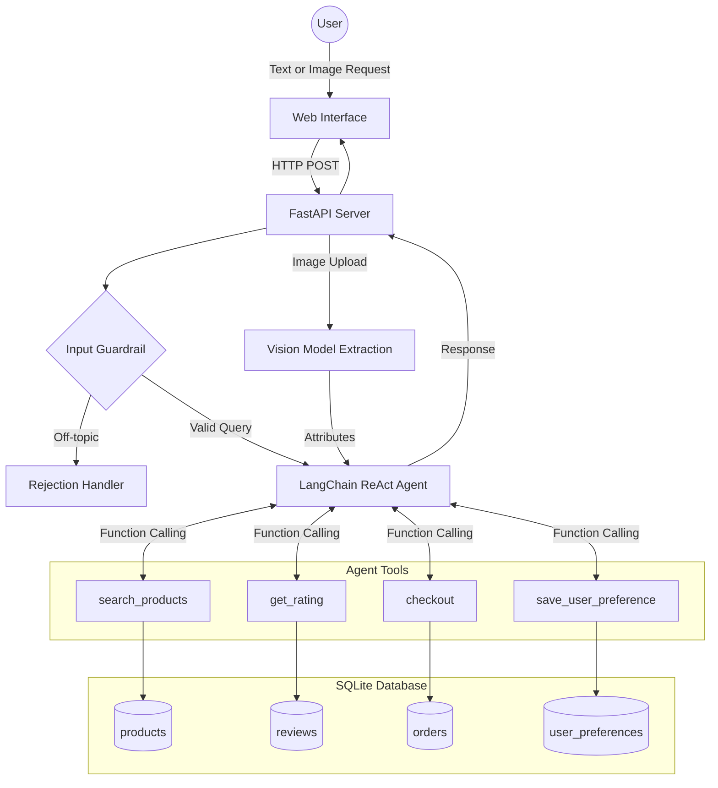

# CartPilot: AI-Powered E-Commerce Agent

A production-ready autonomous shopping assistant utilizing agentic workflows to interact with a backend database, securely process user inputs through guardrails, persist user preferences, and process multimodal vision inputs.

## Architecture & Data Flow

The system architecture separates the frontend client from the backend API, enabling scalability and integration with external microservices.



## Core Components

### 1. Frontend Client
Built with vanilla JavaScript, HTML, and CSS. It provides a responsive interface with skeleton loading states and parses reasoning model outputs into structured elements.

### 2. API Gateway
FastAPI handles incoming HTTP requests, maintains session identifiers for state management, and routes payloads to the LangChain execution environment.

### 3. Agent Execution Engine
The LangChain agent utilizes a ReAct prompting strategy. It evaluates the user's input against available tools, decides the optimal execution path, and synthesizes the final response based on tool outputs.

### 4. Database & Hybrid Search
The agent interacts with an SQLite database via mapped Python functions to execute hard constraints (like max price). It simultaneously utilizes a **FAISS Vector Database** powered by HuggingFace embeddings to perform Semantic Search. This Hybrid Search approach guarantees both mathematical precision and natural language understanding.

## Future Integrations

- **Payment Gateway:** Integration with the Razorpay Developer API within the checkout tool sequence to validate transactions prior to database insertion.

## Local Deployment Setup

1. **Install Dependencies**
```bash
pip install fastapi uvicorn langchain langchain-groq python-multipart python-dotenv
```

2. **Environment Configuration**
Create a `.env` file in the project root:
```env
GROQ_API_KEY=your_api_key_here
```

3. **Database Initialization**
```bash
python setup_db.py
```

4. **Start Application Server**
```bash
python server.py
```
Access the client interface at `http://127.0.0.1:8000`.
